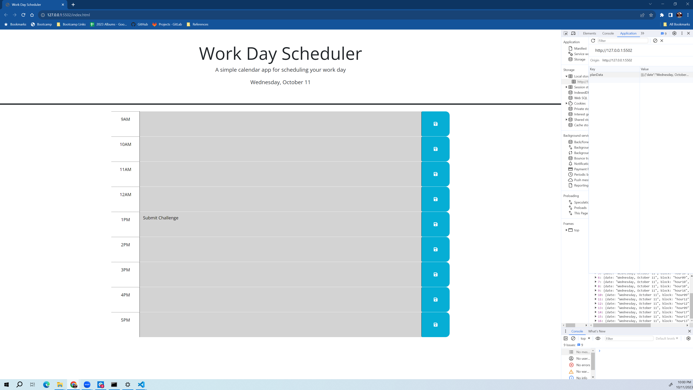

# Daily-Planner
A scheduling tool that allows users to use time efficiently.

https://justdesmarais.github.io/Daily-Planner/

Type an event into the text block and hit the save icon to add data to local storage.  The event will stay in that block even when the site is refreshed!

Starter HTML provided by Develop folder of the challenge and appended by Justin Desmarais.

All JavaScript code provided by Justin Desmarais.

## Screenshot

